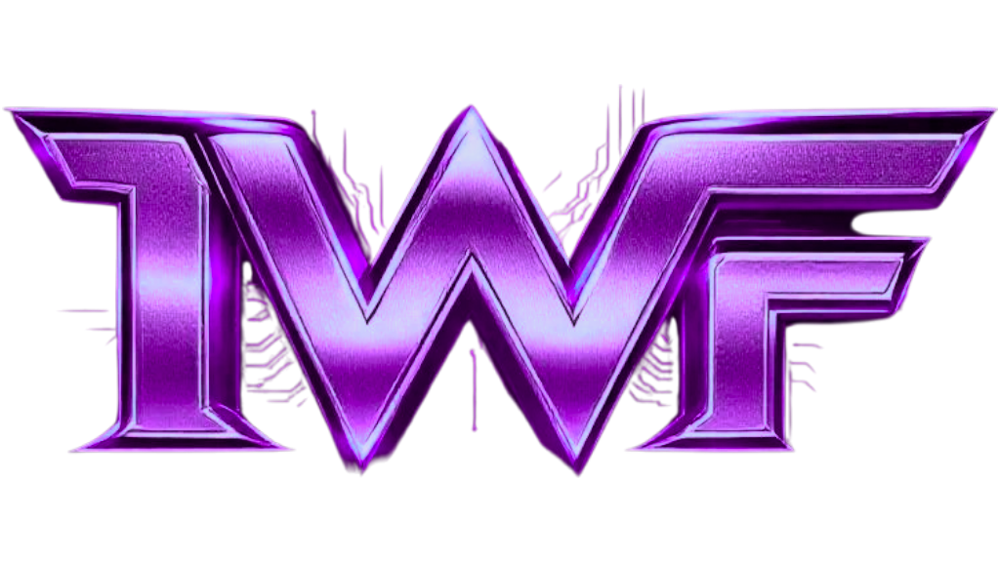

# 
Internet Wrestling Federation

The IWF is a free to join wrestling web app featuring several different modes - career, bookie and simulator.

 

## CAREER MODE
Begin your career as a rookie trying to climb the ranks of professional wrestling. Win matches against historical wrestlers to build up XP and gold, hire managers to get bonuses and boosts and visit the Training Center often to upgrade your skills. Do you have what it takes to become the next IWF Workd Heavyweight Champion?

## BOOKIE MODE
If you're more interested in the behind the scenes / business aspect of pro wrestling, bookie mode is for you! Start your career off as a fledgling regional promoter. Test your skills to see if you have the chops to grow your roster and attract top talent, and run a financially successful promotion of your own!

## SIMULATOR
Step into the ring with IWF! Have you ever wondered how stars from the 80s or 90s would fare against today's wrestlers? Create your dream wrestling matches and simulate epic battles using your favorite historical wrestlers from the Golden Age to present in this ultimate online wrestling simulator.

